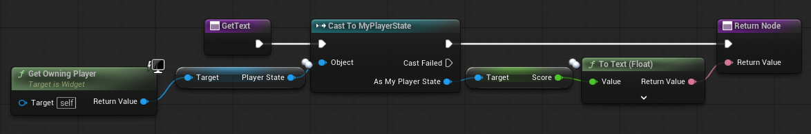
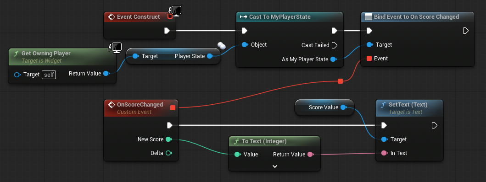

+++
draft = true
date = 2026-01-26T08:51:54-05:00
title = "Custom Events in Unreal"
description = ""
slug = ""
authors = []
tags = []
categories = []
externalLink = ""
series = []
+++

## Intro

Things change quite frequently in games. In Super Mario Bros. scores and coins go up and time ticks down. There are several ways to implement similar UI elements in Unreal and ensure they provide accurate information. Some approaches require less code, but are more heavy-weight. Other ways require more setup and are far more flexible.

I want focus on a simple game where a player runs right, crosses checkpoints, and jumps over gaps. They have a score. Every time the player reaches a checkpoint they get 500 points. If they fall in a pit they lose 300 points and restart from the last checkpoint. Let's assume I've already created a UI widget to display the score on the screen and I'll walk through different ways to ensure that the score is always up to date.

## A Naive First Approach

UI widgets allow binding a property to a function. I can create a binding to the text field of my widget. In the bound function I can read the score, set the text to the score, and return. The good news that this is quick to write. The bad news is this runs every frame.



In a game that runs at 30 frames per second, this widget has ~33.3 ms to update the score before the next frame starts. At 60 frames per second, that time decreases to ~16.6 ms. If the game ran at a blistering 144 frames per second, there's only ~6.9 ms available.

There may be plenty of time for a score widget to update, but everything else in the game needs to update within that shrinking time window as well. Eventually so many things may be updating that the game can't finish in the space of one frame and the player experiences lag.

## Custom Events To The Rescue

A more conservative approach is only processing updates when the underlying data changes. If the player stands still it's unlikely that the score has changed and updating the UI unnecessary. To do this for the score element is to create a score changed event and publishing new values whenever the score changes. This allows the score widget to subscribe to those changes and ensure the UI only updates when the data changes.

Thankfully there's a handy macro for defining a custom event.

```cpp
DECLARE_DYNAMIC_MULTICAST_DELEGATE_OneParam(FOnScoreChanged, uint32, NewScore);
```

This macro creates a multicast delegate struct that can be used as a property on an object, allowing other objects to bind to it. It provides functionality for broadcasting the new score to every subscriber. This version only handles a single parameter but there are variants of the macro that allow up to 9 parameters. Take special note of the required comma between the type `int32` and identifier `NewScore`. It's easy to miss.

Here's a more complete example.

```cpp
// MyPlayerState.h
#pragma once

#include "CoreMinimal.h"
#include "GameFramework/PlayerState.h"
#include "SPlayerState.generated.h"

DECLARE_DYNAMIC_MULTICAST_DELEGATE_TwoParams(FOnScoreChanged, int32, NewScore, int32, Delta);

UCLASS()
class EXAMPLE_API AMyPlayerState : public APlayerState
{
public:
    AMyPlayerState();

    UPROPERTY(BlueprintAssignable)
    FOnScoreChanged OnScoreChanged;

    UFUNCTION(BlueprintCallable)
    void UpdateScore(int32 Delta);

protected:
    float Score;
}
```

```cpp
// MyPlayerState.cpp
AMyPlayerState::AMyPlayerState()
{
    Score = 0;
}

void AMyPlayerState::UpdateScore(int32 Delta)
{
    Score += Delta;

    OnScoreChanged.Broadcast(Score, Delta);
}
```

I've added the score and a custom event to a player state class, which feels like a natural place to keep a score. The multicast delegate here takes two parameters, the new score and the amount by which it changed. The `BlueprintAssignable` annotation above `OnScoreChanged` allows binding to the delegate in C++ and Blueprints.

Now any time the something changes the score it can call `UpdateScore`. This will update the score internally and publish the new score and changed amount to every listener. This will only happen when the function is called and neatly avoids unnecessary processing every frame.

## Binding The UI

To bind this new event to a UI score widget, I chose to use Blueprints, but C++ would work to

```cpp
// MyScoreWidget.h
#pragma once

#include "CoreMinimal.h"
#include "Blueprint/UserWidget.h"
#include "MyScoreWidget.generated.h"

class UTextBlock;

UCLASS()
class ACTIONROGUELIKE_API UMyScoreWidget : public UUserWidget
{
	GENERATED_BODY()

	virtual void NativeConstruct() override;

protected:

	UFUNCTION()
	void OnScoreChanged(int32 NewScore, int32 Delta);

	UPROPERTY()
	TObjectPtr<UTextBlock> Score;
};
```

```cpp
// MyScoreWidget.cpp
#include "MyScoreWidget.h"

#include "MyPlayerState.h"
#include "Components/TextBlock.h"

void UMyScoreWidget::NativeConstruct()
{
	Super::NativeConstruct();

	Score->SetText(FText::FromString(TEXT("0")));

	APlayerController* Character = GetOwningPlayer();
	AMyPlayerState* PlayerState = Character->GetPlayerState<AMyPlayerState>();

	PlayerState->OnScoreChanged.AddDynamic(this, &UMyScoreWidget::OnScoreChanged);
}

void UMyScoreWidget::OnScoreChanged(int32 NewScore, int32 Delta)
{
	Score->SetText(FText::FromString(FString::Printf(TEXT("%d"), NewScore)));
}
```

Doing the same thing in Blueprints, looks like this.



## Wrapping Up

Defining and binding custom events is a very powerful technique that ensures changes are only processed when they occur, freeing up more processing time for everything else. A single UI element probably won't cause lag, even at high frame rates, and makes this example a little artificial. However it's still great to understand how all of this is tied together.

## Further Reading
- [Multicast Delegates in Unreal](https://dev.epicgames.com/documentation/en-us/unreal-engine/multicast-delegates-in-unreal-engine)
